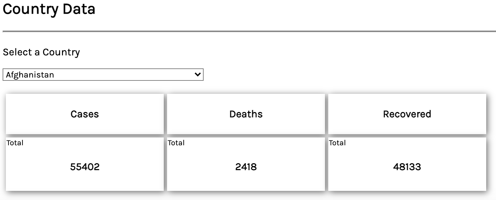

# COVID-19 WORLDWIDE TRACKER  

Repo for the API Hack capstone (Module 11)

Link to live repo: https://sofiamirosans.github.io/apihack-capstone-1/

## Screenshots

## Summary

The COVID-19 Worlwide Tracker is a simple dashboard that enables users from everywhere in the world to track the main KPI's for coronavirus (cases, deaths and recovered patients) both at a global and a country level.

## Technologies 

- HTML
- CSS
- JavaScript
- jQuery

